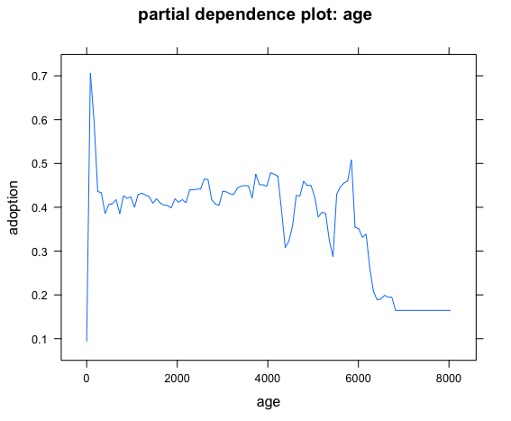

ECO 395M Project
================
Zining Liu
2019/5/15

predicting adoption outcome for cats in Austin Animal Center Shelter
--------------------------------------------------------------------

   

### Abstract

In this project, we build a model to predict the adoption outcome of stray cats in Austin Animal Center Shelter. We use the decision tree and ensemble method to build the model and estimate the accuracy of prediction. Boosting works best in prediction if we allow a sufficiently large number of trees, while Bagging is nearly as good as Boosting, both of which yield a mean square error of approximately 10%. The most important factors that people consider when they adopt a cat from the shelter are age, neuter status, name, and probably main color, and coat pattern. Some limitation might include a very unbalanced breed frequency which might hinder us from getting a good estimate.

   

### Introduction

   

Animal shelter is a non-negligible and large-scale industry. Every year around 6.5 million companion animals enter animal shelters in the U.S. Around 3.2 million of the shelter animals are adopted each year, which is the most ideal result a shelter companion animal could get. With a large number of shelter animals and turnover, these facilities can be costly to run. Most of centers rely on donation, government grants, crowdfunding, and adoption fee to keep their door open. Animal adoption will reduce the cost and bring profits through adoption fee. It is also one of the core functions of the shelter as a humanitarian facility. Thus, it is important to estimate the adoption result for shelter animals, as it helps the center to forecast cost based on adoption prediction and plan ahead to place the animals wisely.

Austin Animal Center Shelter is the biggest animal shelter in Austin which shelters to nearly 20,000 animals. For the purpose of this study, we focus on the prediction of cat adoption result. The data was found on Kaggle, with original source from Austin Open Data Portal. Data contains the outcome of around 30000 shelter cats (adoption, transfer, euthanasia, release, etc.) from 2014 up to now as well as their relevant features, including age, sex, neuter status, breed, name, color and pattern, etc. The purpose is to build a model to predict adoption based on the features, estimate model accuracy and interpret the important factors.

   

### Method

The dataset contains 29421 observations and 37 variables. Variables include id, birth time, sex, neuter, breed information, color and pattern information.

Firstly, we cleaned the data to remove observation with missing results and errors. Secondly, we improved the quality of variables by feature engineering. We created age at outcome variable as the duration of the cat birth time to result time. We created dummy variable for cats with mixed breed (mixed from 2 breeds other than domestic breed). We put the 25 color into 5 categories: white, yellowish, blueish, brownish, black. We created dummy variable to separate long hair cat from the short. Since there are not enough variation for cats in breeds other than domestic short/longhair, we put all other breeds into one bin. Thus, breeds are now dummy variable to classify domestic (mixed) breed from the rest. We labelled result to be 1 (adoption, return to owner), 2 (die, euthanasia, disposal) and 3 (transfer, release). To explore if there are variation in adoption rate for cats with different features, we visualize the adoption frequency as below.

#### Figure 1

#### Figure 2

Figure 1 shows the difference in distribution of age for the three groups. The peak of adoption is when the cats are 50 days to 150 days of age, and the peak of death are below 50 days of age. Figure 2 shows the distribution of neuter status, whether cat is kitten or older, and sex for the three outcome groups. For unneutered group, adoption tends to happen to kitten and might happen more often to female. Adoption rate is much higher for neutered group no matter the age or gender. Within neutered group, kitten is more preferred and male kitten is the most preferred subgroup.

There is indeed variation in feature variables across result groups. So theoretically we could use these variables to make prediction of the adoption result.

Next, we use decision tree to form predictive model. We favor tree method in this case because people usually follow a tree-like process when they make decision of whether to adopt a certain animal or not. They have a list of requirements for companion animal. These requirements follow an ordinal scale so that some are priority, and some are less important. Therefore, we use tree to model this adoption decision, which can be used to predict current shelter animal outcome based on their features.
   

### Result

   

We re-label the result to be dummy variable denoting adoption or not. We deploy a decision tree to classify adoption based on age, sex, neuter, name, cat/kitten, breed, mix breed dummy, breed certification, hair length, main color, minor color and coat pattern.

#### Figure 3

 

The tree we grow is shown in figure 3: top decision node represents if the cat has been neutered. If no, the tree predicts that it will not be adopted though the probability of adoption will differ conditional on if it has a name and if it is older than 52 days. If neuter status is yes, tree predicts no adoption for cats less than 43 days of age. Neutered cats of age 44 days to 182 days are likely to be adopted, and older cats are predicted to be adopted if they have a name.
   

We split the original data set into training data and testing data. Building tree from the training data and testing on the test set gives a confusion matrix as below. Misclassification rate is around 15%.
    adopt tree.pred 0 1 0 2442 238 1 620 2613

We also used cross validation to see if the tree can be pruned as in figure 4. Since the current size is at the bottom of misclass curve, we think that the current tree does not overfit the data thus does not need to be pruned.

   

#### Figure 4

Next, we used bagging and random forest to improve the decision tree. Since there are 12 explanatory variables, we loop from 1 to 12 as the number of variables randomly selected at each decision nodes. In each iteration, we bootstrap from original dataset and build many slightly different trees. We take the average of those trees as if we are using majority voting to predict the likelihood that the animal will be adopted. We plotted the mean squared error curve for out-of-bag (all bootstrap samples except itself, similar to leave-one-out) error and test set error.

Bagging is random forest where we select all 12 variables in each decision node. Bagging mean squared error is shown on the rightmost points in figure 5, which is around 0.11 for OOB and 0.113 for test set. We see that MSE bottom out at 0.105 if we select 3 or 4 variables to split the data in each decision node.

#### Figure 5

We also tried boosting to build 10000 shallow trees and stack them together to reduce the variance. Figure 6 is the variance importance plot by boosting. We see that age, neuter, name, main color and coat pattern are the most important factors. The partial dependence plots are in the appendix.

#### Figure 6

 

Boosting yields an error curve as in figure 7. By creating a sufficiently large number of shallow trees, we could achieve an MSE of 0.103, which is lower than the random forest error marked as the horizontal line.

#### Figure 7

  

### Conclusion

   

Decision tree gives a misclassification rate of 15% whereas bagging and boosting will improve the model. Bagging yielding an MSE of 0.11 and random forests of 4 variables yields an MSE of 0.105, whereas boosting can yield an MSE of 0.103. Or all the 12 variables, age, name and neuter are the most important factors that affect people’s adoption decision. People favor neutered kitten of age 43 days to 182 days, or older neutered cats with a name. Color and pattern might also have some predictive power and people slightly prefer blueish, white and black cats with smoke, tabby and torbie patterns. The reason why breeds information do not enter the tree might be that there are not enough observation with a certified breed (breeds other than domestic short/long hair).

Overall, the tree with boosting and random forest model can be used to predict cat adoption result. It also suggests that neuter and age are the two most important factors, and shelter center should neuter the cats at the right age so that it is easier to get them adopted.

   

 

 

 

 

### Appendix

Boosting - partial dependent plot of the important variables.

The disease and death rates are high (reflected in higher frequency in euthanasia and die) for newborn kittens. People tend to adopt slightly older kittens and the partial dependence is stable over age. Partial dependence drops once the age become larger than 10 years.

Main color and coat pattern also affect people’s decision to adopt a cat. Roughly speaking, blueish, white and black are preferred, and smoke, tabby and tortie-tabby are preferred.
